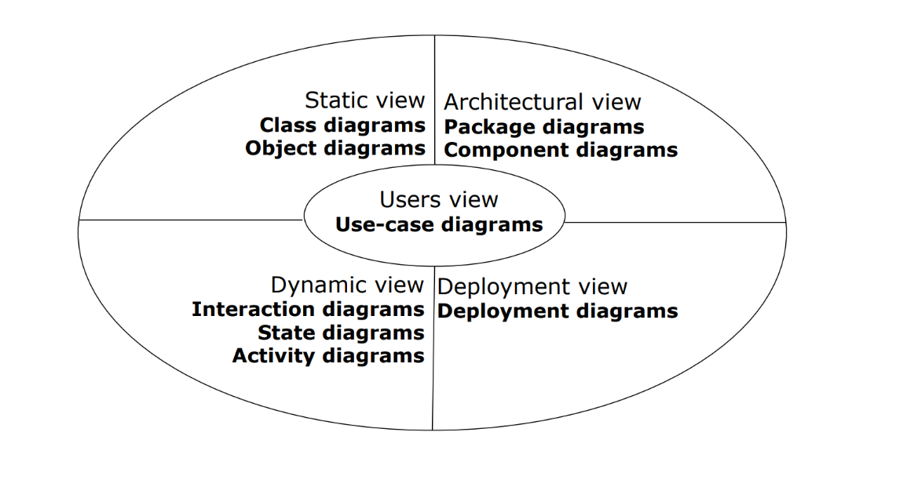

# UML-Diagrams

# Note for learning UML diagrams

# Table of Contents

- [UML-Diagrams](#uml-diagrams)
- [Note for learning UML diagrams](#note-for-learning-uml-diagrams)
- [Table of Contents](#table-of-contents)
- [Diagrams to focus on](#diagrams-to-focus-on)
  - [1. Class Diagram (most important)](#1-class-diagram-most-important)
    - [1.1. Relationships](#11-relationships)
    - [1.2. Class Notation](#12-class-notation)
      - [1.2.1. Perspectives of class diagram](#121-perspectives-of-class-diagram)
    - [1.3. Class Diagram Example: Order System](#13-class-diagram-example-order-system)
  - [2. Use Case Diagram](#2-use-case-diagram)
    - [2.1. Key elements](#21-key-elements)
      - [2.1.1. Actor](#211-actor)
      - [2.1.2. Use Case](#212-use-case)
      - [2.1.3. Communication Link](#213-communication-link)
        - [a, Association](#a-association)
        - [b, Extends](#b-extends)
        - [c, Include](#c-include)
        - [d, Generalization (or Inheritance)](#d-generalization-or-inheritance)
      - [2.1.4. Boundary of system (or Boundary system)](#214-boundary-of-system-or-boundary-system)
    - [2.2. How to Identify Actor](#22-how-to-identify-actor)
    - [2.3. How to Identify Use Cases?](#23-how-to-identify-use-cases)
    - [2.4. Use Case Examples](#24-use-case-examples)
    - [2.5. Use Case Diagram - Vehicle Sales Systems](#25-use-case-diagram---vehicle-sales-systems)
  - [3. Sequence Diagram](#3-sequence-diagram)
    - [3.1. Sequence Diagram Notation](#31-sequence-diagram-notation)
      - [3.1.1. Actor](#311-actor)
      - [3.1.2. Lifeline](#312-lifeline)
      - [3.1.3. Activations](#313-activations)
      - [3.1.4. Messages (communications between lifelines)](#314-messages-communications-between-lifelines)
      - [3.1.5. Note](#315-note)
    - [3.2. Message and Focus of Control](#32-message-and-focus-of-control)
    - [3.3. Sequence Fragments](#33-sequence-fragments)
  - [4. Activity Diagram](#4-activity-diagram)
    - [4.1. Activity Diagram Notation](#41-activity-diagram-notation)
      - [4.1.1. Activity](#411-activity)
      - [4.1.2. Action](#412-action)
      - [4.1.3. Control Flow](#413-control-flow)
      - [4.1.4. Object Flow](#414-object-flow)
      - [4.1.5. Initial Node](#415-initial-node)
      - [4.1.6. Activity Final Node](#416-activity-final-node)
      - [4.1.7. Object Node](#417-object-node)
      - [4.1.8. Decision Node](#418-decision-node)
      - [4.1.9. Merge Node](#419-merge-node)
      - [4.1.10. Fork Node](#4110-fork-node)
      - [4.1.11. Join Node](#4111-join-node)
      - [4.1.12. Swimlane and Partition](#4112-swimlane-and-partition)
  - [5. Entity Relationship Diagram (ERD)](#5-entity-relationship-diagram-erd)
    - [5.1. ERD notations](#51-erd-notations)
      - [5.1.1. Entity](#511-entity)
      - [5.1.2. Entity Attributes](#512-entity-attributes)
      - [5.1.3. Primary key](#513-primary-key)
      - [5.1.4. Foreign key](#514-foreign-key)
      - [5.1.5. Relationship](#515-relationship)
      - [5.1.6. Conceptual, Logical and Physical data models](#516-conceptual-logical-and-physical-data-models)
    - [5.2. Guidelines for Drawing an ERD](#52-guidelines-for-drawing-an-erd)
- [Reference](#reference)

# Diagrams to focus on

<p align="center">
    
</p>


## PlantUML

PlantUML is a free and open-source tool for creating UML diagrams.

- `<a href="https://plantuml.com/">`PlantUML`</a>`

# Reference

- `<a href="https://www.visual-paradigm.com/guide/">`Visual Paradigm`</a>`
- `<a href="https://www.geeksforgeeks.org/system-design/unified-modeling-language-uml-introduction/">`Geeks For Geeks`</a>`

```

```
