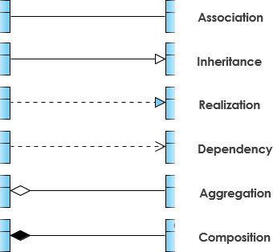

# UML-Diagrams

# Note for learning UML diagrams

# Table of Contents

- [UML-Diagrams](#uml-diagrams)
- [Note for learning UML diagrams](#note-for-learning-uml-diagrams)
- [Table of Contents](#table-of-contents)
- [Diagrams to focus on](#diagrams-to-focus-on)
  - [1. Class Diagram (most important)](#1-class-diagram-most-important)
    - [1.1. Relationships](#11-relationships)
    - [1.2. Class Notation](#12-class-notation)
      - [1.2.1. Perspectives of class diagram](#121-perspectives-of-class-diagram)
    - [1.3. Class Diagram Example: Order System](#13-class-diagram-example-order-system)
  - [2. Use Case Diagram](#2-use-case-diagram)
    - [2.1. Key elements](#21-key-elements)
      - [2.1.1. Actor](#211-actor)
      - [2.1.2. Use Case](#212-use-case)
      - [2.1.3. Communication Link](#213-communication-link)
        - [a, Association](#a-association)
        - [b, Extends](#b-extends)
        - [c, Include](#c-include)
        - [d, Generalization (or Inheritance)](#d-generalization-or-inheritance)
      - [2.1.4. Boundary of system (or Boundary system)](#214-boundary-of-system-or-boundary-system)
    - [2.2. How to Identify Actor](#22-how-to-identify-actor)
    - [2.3. How to Identify Use Cases?](#23-how-to-identify-use-cases)
    - [2.4. Use Case Examples](#24-use-case-examples)
    - [2.5. Use Case Diagram - Vehicle Sales Systems](#25-use-case-diagram---vehicle-sales-systems)
  - [3. Sequence Diagram](#3-sequence-diagram)
  - [4. Activity Diagram](#4-activity-diagram)
  - [5. Entity Relationship Diagram (ERD)](#5-entity-relationship-diagram-erd)
- [Reference](#reference)

# Diagrams to focus on

## 1. Class Diagram (most important)

The class diagram is a central modeling technique that runs through nearly all object-oriented methods.

This diagram describes the types of objects in the system and various kinds of static relationships which exist between them.

### 1.1. Relationships

**There are three principal kinds of relationships which are important:**

- `Association`: represent relationships between instances of types (a person works for a company, a company has a number of offices.
- `Inheritance`: the most obvious addition to ER diagrams for use in OO. It has an immediate correspondence to inheritance in OO design.
- `Aggregation`: Aggregation, a form of object composition in object-oriented design.

**Others add more**

- `Composition`: often taught separately (even though technically it’s a strong form of aggregation).
- `Dependency`: important, but weaker → sometimes grouped as a subtype of “association” or omitted in beginner explanations.
- `Realization`: only appears with interfaces → some courses don’t include it in “principal” relationships.

<p align="center"> 
    
</p>

**Quick Memory Hack**

- Dependency → "uses" (temporary).
- Association → "has-a" (permanent link).
- Aggregation → "has-a but independent".
- Composition → "has-a but dependent".
- Generalization → "is-a" (inheritance).
- Realization → "implements interface".

**Rate and Example:**

**1. Dependency**

- Meaning: Class A depends on B (A uses B temporarily, e.g., as a parameter, local variable).
- Strength: Weak, short-lived.
- Example:

```java
    class ReportService {
        void export(PdfExporter exporter) { ... }
        // ReportService depends on PdfExporter
    }
```

<p align="center"> 
    
</p>

**2. Association**

- Meaning: Class A has a reference to B (longer-term relationship).
- Strength: Stronger than dependency
- Example:

```java
    class Order {
        Customer customer;
        // association between Order and Customer
    }
```

**Cardinality:**

Cardinality is expressed in terms of:

- one to one
- one to many
- many to many

<p align="center"> 
    
</p>

**3. Aggregation**

- Meaning: "Has-a" relationship, but weak ownership
- Lifespan: The part can exist independently of the whole.
- Example:

```java
    class Team {
        List<Player> players;
        // Players can exist without Team
    }
```

<p align="center"> 
    
</p>

**4. Composition**

- Meaning: “Has-a” relationship with strong ownership.
- Lifespan: If the whole is destroyed, the part is destroyed too.
- Example:

```java
    class House {
        Room[] rooms;
        // Rooms cannot exist without House
    }
```

<p align="center"> 
    
</p>

**5. Generalization (or inheritance)**

- Meaning: Inheritance ("is-a" relationship).
- Example:

```java
    class Animal { }
    class Dog extends Animal { }  // Dog is an Animal
```

<p align="center"> 
    
</p>

**6. Realization**

- Meaning: Interface implementation.
- Example:

```java
    interface Owner {
        void acquire(Property property);
        void dispose(Property property);
    }

    class Person implements Owner {
        private Property real;
        private Property tangible;
        private Property intangible;

        @Override
        public void acquire(Property property) {
            // implementation for a person
        }

        @Override
        public void dispose(Property property) {
            // implementation for a person
        }
    }

    class Corporation implements Owner {
        private Property current;
        private Property fixed;
        private Property longTerm;
        private Property intangible;

        @Override
        public void acquire(Property property) {
            // implementation for a corporation
        }

        @Override
        public void dispose(Property property) {
            // implementation for a corporation
        }
    }
```

<p align="center"> 
    
</p>

### 1.2. Class Notation

**Visibility Notation:** indicate the access level of attributes and methods.

Common visibility notations include:

- `+` for public access modifier (visible to all classes)
- `-` for private access modifier (visible only within the class)
- `#` for protected access modifier (visible to subclasses)
- `~` for package or default visibility access modifier (visible to classes in the same package)

<p align="center">
    
    
</p>

#### 1.2.1. Perspectives of class diagram

A diagram can be interpreted from various perspectives:

- `Conceptual`: represents the concepts in the domain
- `Specification`: focus is on the interfaces of Abstract Data Type (ADTs) in the software
- `Implementation`: describes how classes will implement their interfaces

<p align="center"> 
    
</p>

### 1.3. Class Diagram Example: Order System

<p align="center"> 
    
</p>

## 2. Use Case Diagram

- Shows how users (actors) interact with the system.
- Focus: What the system does (functional requirements), not how it does it.

<p align="center"> 
    
</p>

### 2.1. Key elements

- `Actor`: external entity (user, another system).
- `Use Case`: functionality (action) the system provides.
- `System boundary`: a box representing the system itself.
- `Relationships`:
  - `Association` (actor ↔ use case).
  - `«include»` (one use case always uses another).
  - `«extend»` (optional extension).

#### 2.1.1. Actor

- Someone interacts with use case (system function).
- Named by noun.
- Actor plays a role in the business
- Similar to the concept of user, but a user can play different roles
- For example:
  - A prof. can be instructor and also researcher
  - plays 2 roles with two systems
- Actor triggers use case(s).
- Actor has a responsibility toward the system (inputs), and Actor has expectations from the system (outputs).

<p align="center"> 
    
</p>

#### 2.1.2. Use Case

- System function (process - automated or manual)
- Named by verb + Noun (or Noun Phrase).
- i.e. Do something
- Each Actor must be linked to a use case, while some use cases may not be linked to actors.

<p align="center"> 
    
</p>

#### 2.1.3. Communication Link

<p align="center"> 
    
</p>

##### a, Association

- Actor ↔ Use Case connection (solid line).
- Shows communication between the actor and the system (sending/receiving messages).

##### b, Extends

- Optional/conditional behavior.
- Child use case extends the functionality of a base use case.
- Shown with a dashed arrow pointing to the base use case.
- Example: Login ← «extend» Invalid Password.

##### c, Include

- Mandatory reuse of functionality.
- Base use case always includes another use case as part of its flow.
- Shown with a dashed arrow pointing to the included (child) use case.
- Example: Checkout → «include» Payment Processing.

##### d, Generalization (or Inheritance)

- Parent-child relationship between use cases.
- Child use case is a specialized/enhanced version of the parent.
- Shown with a solid line and a hollow triangle pointing to the parent use case.

**Quick memory aid:**

- Association → actor communicates with use case.
- Extend → sometimes adds behavior.
- Include → always reuses behavior.
- Generalization → specialization of another use case.

#### 2.1.4. Boundary of system (or Boundary system)

- The system boundary represents what is inside (system functionality) vs. outside (actors).
- It usually covers the entire system as defined in the requirements.
- For large/complex systems, each module can be treated as its own system boundary.
- Example: In an ERP system, modules like Personnel, Payroll, Accounting each have their own boundary.
- The overall system boundary can also encompass all modules together to show the full system.

<p align="center"> 
    
</p>

### 2.2. How to Identify Actor

Often, people find it easiest to start the requirements elicitation process by identifying the actors. The following questions can help you identify the actors of your system (Schneider and Winters - 1998):

- Who uses the system?
- Who installs the system?
- Who starts up the system?
- Who maintains the system?
- Who shuts down the system?
- What other systems use this system?
- Who gets information from this system?
- Who provides information to the system?
- Does anything happen automatically at a present time?

### 2.3. How to Identify Use Cases?

Identifying the Use Cases, and then the scenario-based elicitation process carries on by asking what externally visible, observable value that each actor desires. The following questions can be asked to identify use cases, once your actors have been identified (Schneider and Winters - 1998):

- What functions will the actor want from the system?
- Does the system store information? What actors will create, read, update or delete this information?
- Does the system need to notify an actor about changes in the internal state?
- Are there any external events the system must know about? What actor informs the system of those events?

### 2.4. Use Case Examples

**Use Case Example - Association Link**

<p align="center"> 
    
</p>

```java
    // Actor: Student
    class Student {
        private String name;

        public Student(String name) {
            this.name = name;
        }

        // Student interacts with the system by borrowing a book
        public void borrowBook(Library library, String bookTitle) {
            library.borrowBook(this, bookTitle);
        }

        public String getName() {
            return name;
        }
    }

    // System: Library
    class Library {
        // Borrow Books Use Case
        public void borrowBook(Student student, String bookTitle) {
            System.out.println(student.getName() + " borrowed the book: " + bookTitle);
        }
    }

    // Main program to simulate the Use Case
    public class UseCaseDemo {
        public static void main(String[] args) {
            Student student = new Student("Alice");
            Library library = new Library();

            // Interaction (Use Case: Borrow Books)
            student.borrowBook(library, "Design Patterns in Java");
        }
    }
```

**Use Case Example - Include Relationship**

<p align="center"> 
    
</p>

```java
    // Actor: Student
    class Student {
        private String name;

        public Student(String name) {
            this.name = name;
        }

        // Student triggers the borrow books use case
        public void borrowBook(Library library, String bookTitle) {
            library.borrowBook(this, bookTitle);
        }

        public String getName() {
            return name;
        }
    }

    // System Boundary: Library
    class Library {

        // Main use case: Borrow Books
        public void borrowBook(Student student, String bookTitle) {
            System.out.println(student.getName() + " wants to borrow: " + bookTitle);

            // <<include>> Check Reserved Book
            if (checkReservedBook(bookTitle)) {
                System.out.println("Book is reserved. Borrowing not allowed.");
                return;
            }

            // <<include>> Check Fine
            if (checkFine(student)) {
                System.out.println("Outstanding fine exists. Borrowing not allowed.");
                return;
            }

            System.out.println(student.getName() + " successfully borrowed: " + bookTitle);
        }

        // Included use case: Check Reserved Book
        private boolean checkReservedBook(String bookTitle) {
            // Simulate reserved book logic
            return "Design Patterns in Java".equalsIgnoreCase(bookTitle);
        }

        // Included use case: Check Fine
        private boolean checkFine(Student student) {
            // Simulate fine checking logic
            return student.getName().equalsIgnoreCase("Alice"); // Example: Alice has fines
        }
    }

    // Demo program
    public class UseCaseDemo {
        public static void main(String[] args) {
            Library library = new Library();

            Student student1 = new Student("Alice");
            Student student2 = new Student("Bob");

            // Alice tries to borrow a book but has a fine
            student1.borrowBook(library, "Clean Code");

            System.out.println();

            // Bob tries to borrow a reserved book
            student2.borrowBook(library, "Design Patterns in Java");

            System.out.println();

            // Bob borrows a normal book
            student2.borrowBook(library, "Effective Java");
        }
    }
```

**Extend - Relationship**

<p align="center"> 
    
</p>

```java
    // Actor: Student
    class Student {
        private String name;

        public Student(String name) {
            this.name = name;
        }

        // Main Use Case: Request a Book
        public void requestBook(LibrarySystem library, String bookTitle) {
            System.out.println(name + " is requesting the book: " + bookTitle);
            library.requestBook(bookTitle);
        }
    }

    // System Boundary (Library System)
    class LibrarySystem {

        // Main Use Case: Request a Book
        public void requestBook(String bookTitle) {
            System.out.println("Processing request for: " + bookTitle);

            // <<extend>> : Search
            if (!isBookAvailable(bookTitle)) {
                search(bookTitle);  // Extension happens only if condition is met
            }
        }

        // Extension Point: Search
        private void search(String bookTitle) {
            System.out.println("Searching for the book: " + bookTitle);
            // simulate database lookup
            System.out.println("Book not available in current inventory.");
        }

        private boolean isBookAvailable(String bookTitle) {
            // Hardcoded for example; real system would query DB
            return bookTitle.equalsIgnoreCase("Java Programming");
        }
    }

    // Main Program
    public class UseCaseExtendDemo {
        public static void main(String[] args) {
            LibrarySystem library = new LibrarySystem();
            Student student = new Student("Alice");

            // Case 1: Book available
            student.requestBook(library, "Java Programming");

            System.out.println("---------------------------");

            // Case 2: Book not available → triggers <<extend>> Search
            student.requestBook(library, "Design Patterns");
        }
    }
```

**Use Case Example - Generalization Relationship**

<p align="center"> 
    
</p>

```java
    // Base Use Case: Search
    abstract class Search {
        protected String query;

        public Search(String query) {
            this.query = query;
        }

        // General behavior
        public abstract void execute();
    }

    // Specialized Use Case: Search by Call Number
    class SearchByCallNumber extends Search {
        public SearchByCallNumber(String callNumber) {
            super(callNumber);
        }

        @Override
        public void execute() {
            System.out.println("Searching by Call Number: " + query);
            // Simulate database search
            System.out.println("Book found with call number " + query);
        }
    }

    // Specialized Use Case: Search by Author
    class SearchByAuthor extends Search {
        public SearchByAuthor(String authorName) {
            super(authorName);
        }

        @Override
        public void execute() {
            System.out.println("Searching by Author: " + query);
            // Simulate database search
            System.out.println("Books found by author " + query);
        }
    }

    // Main Program
    public class SearchDemo {
        public static void main(String[] args) {
            Search search1 = new SearchByCallNumber("QA76.73.J38");
            search1.execute();

            System.out.println("---------------------");

            Search search2 = new SearchByAuthor("Robert Martin");
            search2.execute();
        }
    }
```

### 2.5. Use Case Diagram - Vehicle Sales Systems

<p align="center"> 
    
</p>

## 3. Sequence Diagram

## 4. Activity Diagram

## 5. Entity Relationship Diagram (ERD)

# Reference

- <a href="https://www.visual-paradigm.com/guide/">Visual Paradigm</a>
- <a href="https://www.geeksforgeeks.org/system-design/unified-modeling-language-uml-introduction/">Geeks For Geeks</a>
