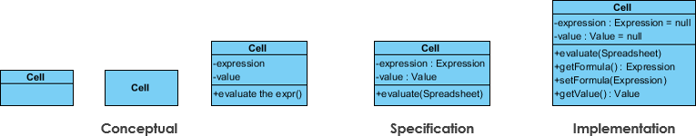

# Table of Contents

- [Table of Contents](#table-of-contents)
- [Diagrams to focus on](#diagrams-to-focus-on)
  - [1. Class Diagram (most important)](#1-class-diagram-most-important)
    - [Relationships](#relationships)
    - [Class Notation](#class-notation)
      - [Perspectives of class diagram](#perspectives-of-class-diagram)
    - [Class Diagram Example: Order System](#class-diagram-example-order-system)
  - [2. Use Case Diagram](#2-use-case-diagram)
  - [Reference](#reference)

# Diagrams to focus on

## 1. Class Diagram (most important)

The class diagram is a central modeling technique that runs through nearly all object-oriented methods.

This diagram describes the types of objects in the system and various kinds of static relationships which exist between them.

### Relationships

**There are three principal kinds of relationships which are important:**

- `Association`: represent relationships between instances of types (a person works for a company, a company has a number of offices.
- `Inheritance`: the most obvious addition to ER diagrams for use in OO. It has an immediate correspondence to inheritance in OO design.
- `Aggregation`: Aggregation, a form of object composition in object-oriented design.

**Others add more**

- `Composition`: often taught separately (even though technically it’s a strong form of aggregation).
- `Dependency`: important, but weaker → sometimes grouped as a subtype of “association” or omitted in beginner explanations.
- `Realization`: only appears with interfaces → some courses don’t include it in “principal” relationships.

<p align="center"> 
    
</p>

**Quick Memory Hack**

- Dependency → "uses" (temporary).
- Association → "has-a" (permanent link).
- Aggregation → "has-a but independent".
- Composition → "has-a but dependent".
- Generalization → "is-a" (inheritance).
- Realization → "implements interface".

**Rate and Example:**

**1. Dependency**

- Meaning: Class A depends on B (A uses B temporarily, e.g., as a parameter, local variable).
- Strength: Weak, short-lived.
- Example:

```java
    class ReportService {
        void export(PdfExporter exporter) { ... }
        // ReportService depends on PdfExporter
    }
```

<p align="center"> 
    
</p>

**2. Association**

- Meaning: Class A has a reference to B (longer-term relationship).
- Strength: Stronger than dependency
- Example:

```java
    class Order {
        Customer customer;
        // association between Order and Customer
    }
```

**Cardinality:**

Cardinality is expressed in terms of:

- one to one
- one to many
- many to many

<p align="center"> 
    
</p>

**3. Aggregation**

- Meaning: "Has-a" relationship, but weak ownership
- Lifespan: The part can exist independently of the whole.
- Example:

```java
    class Team {
        List<Player> players;
        // Players can exist without Team
    }
```

<p align="center"> 
    
</p>

**4. Composition**

- Meaning: “Has-a” relationship with strong ownership.
- Lifespan: If the whole is destroyed, the part is destroyed too.
- Example:

```java
    class House {
        Room[] rooms;
        // Rooms cannot exist without House
    }
```

<p align="center"> 
    
</p>

**5. Generalization (or inheritance)**

- Meaning: Inheritance ("is-a" relationship).
- Example:

```java
    class Animal { }
    class Dog extends Animal { }  // Dog is an Animal
```

<p align="center"> 
    
</p>

**6. Realization**

- Meaning: Interface implementation.
- Example:

```java
    interface Owner {
        void acquire(Property property);
        void dispose(Property property);
    }

    class Person implements Owner {
        private Property real;
        private Property tangible;
        private Property intangible;

        @Override
        public void acquire(Property property) {
            // implementation for a person
        }

        @Override
        public void dispose(Property property) {
            // implementation for a person
        }
    }

    class Corporation implements Owner {
        private Property current;
        private Property fixed;
        private Property longTerm;
        private Property intangible;

        @Override
        public void acquire(Property property) {
            // implementation for a corporation
        }

        @Override
        public void dispose(Property property) {
            // implementation for a corporation
        }
    }
```

<p align="center"> 
    
</p>

### Class Notation

**Visibility Notation:** indicate the access level of attributes and methods.

Common visibility notations include:

- "+" for public access modifier (visible to all classes)
- "-" for private access modifier (visible only within the class)
- "#" for protected access modifier (visible to subclasses)
- "~" for package or default visibility access modifier (visible to classes in the same package)

<p align="center">
    
    
</p>

#### Perspectives of class diagram

A diagram can be interpreted from various perspectives:

- `Conceptual`: represents the concepts in the domain
- `Specification`: focus is on the interfaces of Abstract Data Type (ADTs) in the software
- `Implementation`: describes how classes will implement their interfaces

<p align="center"> 
    
</p>

### Class Diagram Example: Order System

<p align="center"> 
    
</p>

## 2. Use Case Diagram

## Reference

- <a href="https://www.visual-paradigm.com/guide/">Visual Paradigm</a>
- <a href="https://www.geeksforgeeks.org/system-design/unified-modeling-language-uml-introduction/">Geeks For Geeks</a>
